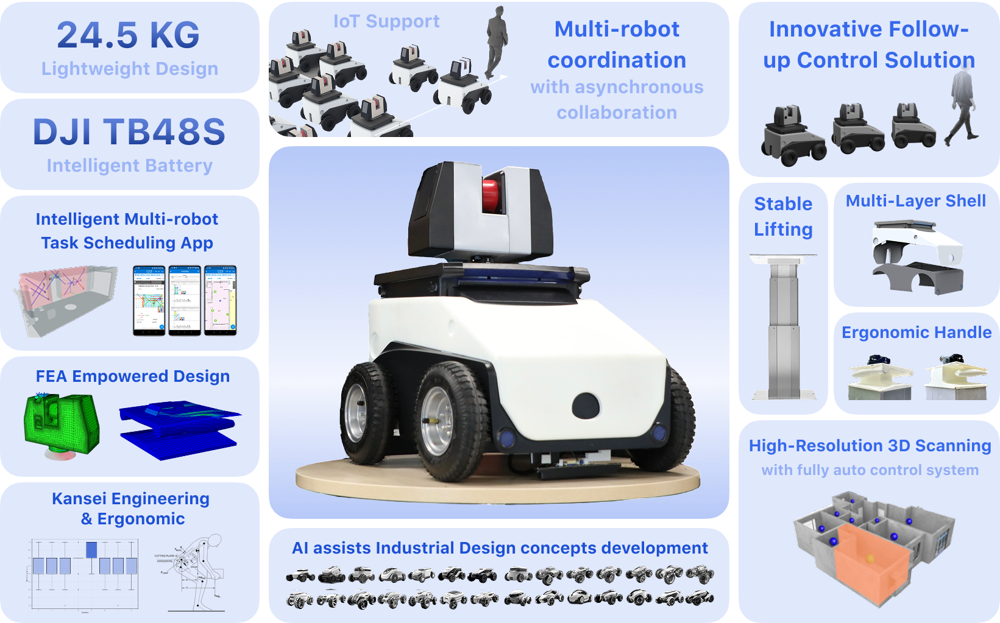

# Autonomous Scanning Collaboration Solution within the Same Building

## SDIM Group 3 - Fall 2023 at Southern University of Science and Technology

We are Group 3 from the School of System Design and Intelligent Manufacturing (SDIM) during the Fall 2023 semester at Southern University of Science and Technology. We have proposed an autonomous scanning solution designed for collaborative operation within the same building. This solution is aimed at alleviating the physical labor burden of technical workers in construction site measurement and quantification tasks.

### Design and Functionality

Explore more on my personal website: https://huangjuncarlin.me/hero-works/uycl360

In terms of appearance, we have conducted Kansei Engineering measurements and established engineering features to create a design that meets the enterprise's demands for a sense of technology and reliability. Functionally, we have broken down the requirements into four aspects: movement, scanning, scheduling, and management. We have implemented various technical solutions, including:

- A screw rail scanner lifting mechanism
- Ultra-wideband wireless communication for centimeter-level machine positioning
- UWB feedback control for following the operator's movement
- Dual-loop motion control with PID for speed and position
- Part simulation and optimization using Abaqus
- APP and physical controller design compliant with ergonomics

For a detailed overview, please refer to our key selling points image below:

### Open Source Commitment

We are committed to open-sourcing as many of the technologies and techniques we have applied as possible, with the hope of aiding your learning journey. 
However, please note that some documentation may involve third-party commercial copyrights, and we will upload such material after proper anonymization and consideration.

By the way, in most cases our source text or files in this repository are in Chinese. But we will try our best to translate those parts into English via DeepL or Google Translate.

### How You Can Contribute

If you find this useful, please give us a Star or let us know! Should you have any questions, feel free to ask us.

